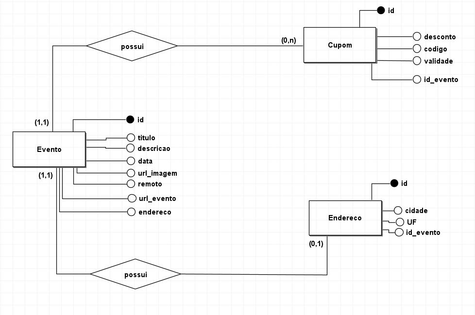
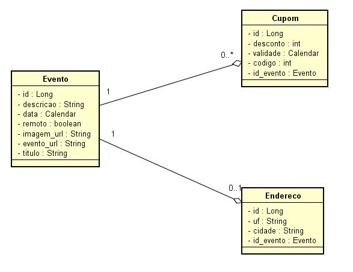
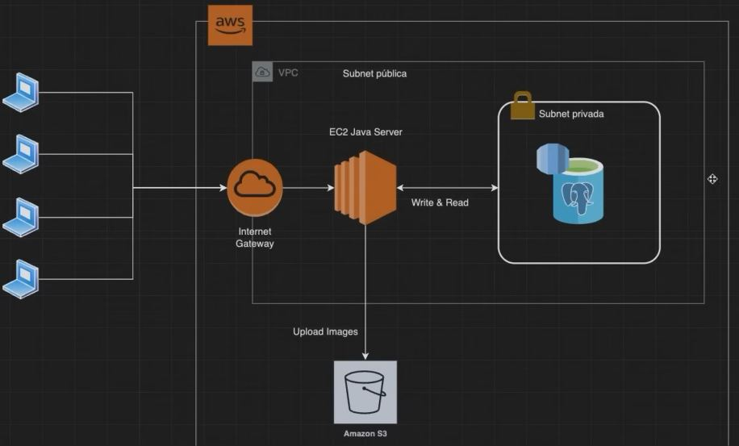

# API Spring Boot de E-mails

**API Spring Boot 3.x de Gerenciamento de Eventos**

## O que foi desenvolvido
**Backend de aplicação responsável por gerenciar eventos**


## Modelagem Banco de Dados


## Modelagem Classes Conceitual


## Arquitetura Cloud
**A aplicação será implantanda em uma instância Amazon**

**Recursos AWS**
- **IAM**
- **VPC**
- **Gateway**
- **EC2 Amazon Linux 2023 AMI dentro de uma subnet publica**
- **S3**
- **RDS PostgreSQL**




## Tecnologias

- **Java 17** 
- **Apache Maven** 
- **Spring Boot** 
- **Spring IoC**
- **Devtools**
- **Lombok**
- **Flyway**
- **PostgreSQL** 
- **Amazon S3** 

## Como rodar a aplicação

**Inicie a aplicação usando qualquer um dos comandos abaixo**

> **Nota:** Para os dois primeiros comandos, é necessario executar dentro da pasta raiz do projeto i.e **eventos-tec** pasta

- **Usando maven** ``` mvn spring-boot:run```

- **A partir de arquivo jar**
  Criar um arquivo jar usando o comando '**mvn clean install**' e então executar 
  <br/>```java -jar target/eventos-tec-0.0.1-SNAPSHOT.jar```


- **Diretamente a partir de uma IDE**
  <br/>```Clicar com o botão direito em EventosTecApplication.java e então clicar na opção 'Run' ```
  <br/><br/>

> **Nota:** Por padrão aplicações Spring Boot iniciam na porta 8080. 
Se a porta 8080 estiver ocupada em seu sistema, então voce pode mudar o numero da porta atualizando a linha **server.port**  dentro do arquivo 
**application.properties** que esta disponivel dentro da pasta **src > main > resources**.

<br/>

**API Collection Postman incluido para testes **